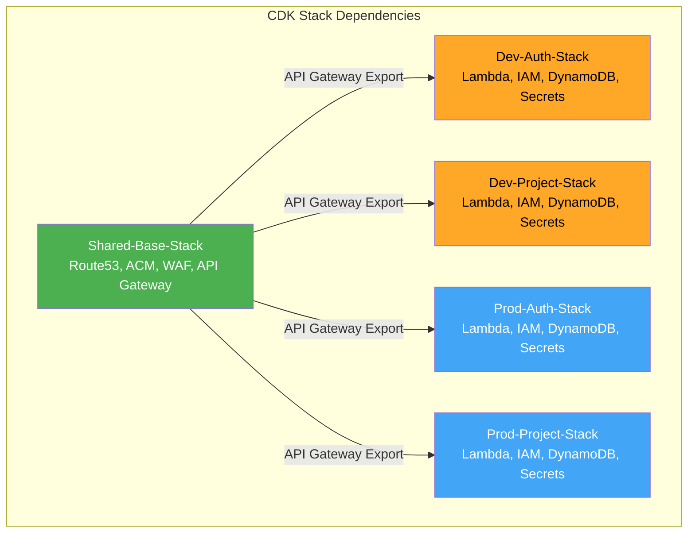
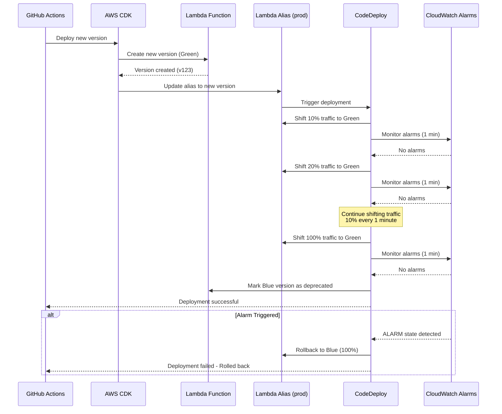

# U3: Project Domain - Deployment Architecture

## Overview

本ドキュメントでは、U3: Project Domainのデプロイメントアーキテクチャを定義します。

**Focus**: デプロイメント構成、CI/CDパイプライン、環境戦略

---

## 1. System Architecture Diagram

### 1.1 Overall Architecture

```mermaid
graph TB
    subgraph Internet["Internet"]
        Client["Client Applications<br/>(Web/Mobile)"]
    end
    
    subgraph AWS["AWS Cloud (ap-northeast-1)"]
        subgraph SharedBase["Shared-Base-Stack"]
            Route53["Route53<br/>DNS Management"]
            ACM["ACM<br/>SSL Certificates"]
            WAF["WAF<br/>Web Application Firewall"]
            APIGW["API Gateway<br/>REST API"]
        end
        
        subgraph DevEnv["Development Environment"]
            subgraph DevAuth["Dev-Auth-Stack"]
                DevAuthLambda["Lambda Function<br/>u2-authentication-dev<br/>512MB, 30s"]
                DevAuthRole["IAM Role<br/>u2-auth-dev"]
                DevAuthDDB["DynamoDB<br/>AuthenticationDomain-dev<br/>On-Demand"]
                DevAuthSecrets["Secrets Manager<br/>u2-auth-secrets-dev"]
            end
            
            subgraph DevProject["Dev-Project-Stack"]
                DevProjectLambda["Lambda Function<br/>u3-project-dev<br/>1024MB, 30s"]
                DevProjectRole["IAM Role<br/>u3-project-dev"]
                DevProjectDDB["DynamoDB<br/>ProjectDomain-dev<br/>On-Demand"]
                DevProjectSecrets["Secrets Manager<br/>u3-project-secrets-dev"]
            end
        end
        
        subgraph ProdEnv["Production Environment"]
            subgraph ProdAuth["Prod-Auth-Stack"]
                ProdAuthLambda["Lambda Function<br/>u2-authentication-prod<br/>512MB, 30s"]
                ProdAuthRole["IAM Role<br/>u2-auth-prod"]
                ProdAuthDDB["DynamoDB<br/>AuthenticationDomain-prod<br/>On-Demand"]
                ProdAuthSecrets["Secrets Manager<br/>u2-auth-secrets-prod"]
            end
            
            subgraph ProdProject["Prod-Project-Stack"]
                ProdProjectLambda["Lambda Function<br/>u3-project-prod<br/>1024MB, 30s"]
                ProdProjectRole["IAM Role<br/>u3-project-prod"]
                ProdProjectDDB["DynamoDB<br/>ProjectDomain-prod<br/>On-Demand"]
                ProdProjectSecrets["Secrets Manager<br/>u3-project-secrets-prod"]
            end
        end
        
        subgraph Monitoring["Monitoring & Observability"]
            CWLogs["CloudWatch Logs<br/>7 days retention"]
            CWMetrics["CloudWatch Metrics<br/>Custom + AWS"]
            CWAlarms["CloudWatch Alarms<br/>5 alarms"]
            XRay["AWS X-Ray<br/>Distributed Tracing"]
        end
    end
    
    Client -->|HTTPS| WAF
    WAF --> APIGW
    APIGW -->|dev stage| DevAuthLambda
    APIGW -->|dev stage| DevProjectLambda
    APIGW -->|prod stage| ProdAuthLambda
    APIGW -->|prod stage| ProdProjectLambda
    
    DevAuthLambda --> DevAuthDDB
    DevAuthLambda --> DevAuthSecrets
    DevAuthLambda --> CWLogs
    DevAuthLambda --> XRay
    
    DevProjectLambda --> DevProjectDDB
    DevProjectLambda --> DevProjectSecrets
    DevProjectLambda --> CWLogs
    DevProjectLambda --> XRay
    DevProjectLambda --> CWMetrics
    
    ProdAuthLambda --> ProdAuthDDB
    ProdAuthLambda --> ProdAuthSecrets
    ProdAuthLambda --> CWLogs
    ProdAuthLambda --> XRay
    
    ProdProjectLambda --> ProdProjectDDB
    ProdProjectLambda --> ProdProjectSecrets
    ProdProjectLambda --> CWLogs
    ProdProjectLambda --> XRay
    ProdProjectLambda --> CWMetrics
    
    CWMetrics --> CWAlarms
    
    style SharedBase fill:#E8F4F8
    style DevEnv fill:#FFF4E6
    style ProdEnv fill:#E8F5E9
    style Monitoring fill:#F3E5F5
```



---

## 2. CDK Stack Architecture

### 2.1 Stack Hierarchy



**Stack Details**:

| Stack Name | Resources | Update Frequency | Environment | Domain |
|------------|-----------|------------------|-------------|--------|
| **Shared-Base-Stack** | Route53, ACM, WAF, API Gateway | 低（月1回以下） | 共通 | 基盤 |
| **Dev-Auth-Stack** | Lambda, IAM, DynamoDB, Secrets | 高（週数回） | dev | U2 |
| **Dev-Project-Stack** | Lambda, IAM, DynamoDB, Secrets | 高（週数回） | dev | U3 |
| **Prod-Auth-Stack** | Lambda, IAM, DynamoDB, Secrets | 中（週1回） | prod | U2 |
| **Prod-Project-Stack** | Lambda, IAM, DynamoDB, Secrets | 中（週1回） | prod | U3 |

---

### 2.2 Stack Resource Mapping

**Shared-Base-Stack**:
```typescript
// Infrastructure shared across all environments
- Route53 Hosted Zone
- ACM Certificate
- WAF Web ACL
- API Gateway REST API (shared)
  - /dev stage
  - /prod stage
```

**Dev-Auth-Stack**:
```typescript
// Development environment - Authentication domain
- Lambda Function: u2-authentication-function-dev
- IAM Role: u2-authentication-lambda-execution-role-dev
- DynamoDB Table: AuthenticationDomain-dev
- Secrets Manager: u2-auth-secrets-dev
- API Gateway Integration: /dev/api/v1/auth/*
```

**Dev-Project-Stack**:
```typescript
// Development environment - Project domain
- Lambda Function: u3-project-function-dev
- IAM Role: u3-project-lambda-execution-role-dev
- DynamoDB Table: ProjectDomain-dev
- Secrets Manager: u3-project-secrets-dev
- API Gateway Integration: /dev/api/v1/projects/*, /dev/api/v1/templates/*
```

**Prod-Auth-Stack**:
```typescript
// Production environment - Authentication domain
- Lambda Function: u2-authentication-function-prod
- IAM Role: u2-authentication-lambda-execution-role-prod
- DynamoDB Table: AuthenticationDomain-prod
- Secrets Manager: u2-auth-secrets-prod
- API Gateway Integration: /prod/api/v1/auth/*
- Lambda Alias: prod (Blue-Green)
- CodeDeploy DeploymentGroup
```

**Prod-Project-Stack**:
```typescript
// Production environment - Project domain
- Lambda Function: u3-project-function-prod
- IAM Role: u3-project-lambda-execution-role-prod
- DynamoDB Table: ProjectDomain-prod
- Secrets Manager: u3-project-secrets-prod
- API Gateway Integration: /prod/api/v1/projects/*, /prod/api/v1/templates/*
- Lambda Alias: prod (Blue-Green)
- CodeDeploy DeploymentGroup
```

---

## 3. CI/CD Pipeline Architecture

### 3.1 GitHub Actions Pipeline

```mermaid
graph LR
    subgraph GitRepo["GitHub Repository"]
        DevelopBranch["develop branch"]
        MainBranch["main branch"]
    end
    
    subgraph BuildStage["Build & Test"]
        Checkout["Checkout Code"]
        InstallDeps["npm install"]
        Lint["npm run lint"]
        UnitTest["npm test"]
        IntegrationTest["npm run test:integration"]
        Build["npm run build"]
    end
    
    subgraph DeployDev["Deploy to Dev"]
        CDKSynthDev["cdk synth"]
        CDKDeployDev["cdk deploy Dev-*-Stack"]
        SmokeTestDev["Smoke Tests (dev)"]
    end
    
    subgraph DeployProd["Deploy to Prod"]
        ApprovalGate["Manual Approval Gate"]
        CDKSynthProd["cdk synth"]
        CDKDeployProd["cdk deploy Prod-*-Stack<br/>Blue-Green Deployment"]
        SmokeTestProd["Smoke Tests (prod)"]
        MonitorAlarms["Monitor Alarms (5 min)"]
    end
    
    DevelopBranch -->|Push| Checkout
    MainBranch -->|Push| Checkout
    
    Checkout --> InstallDeps
    InstallDeps --> Lint
    Lint --> UnitTest
    UnitTest --> IntegrationTest
    IntegrationTest --> Build
    
    Build -->|develop branch| CDKSynthDev
    CDKSynthDev --> CDKDeployDev
    CDKDeployDev --> SmokeTestDev
    
    Build -->|main branch| ApprovalGate
    ApprovalGate -->|Approved| CDKSynthProd
    CDKSynthProd --> CDKDeployProd
    CDKDeployProd --> SmokeTestProd
    SmokeTestProd --> MonitorAlarms
    
    style BuildStage fill:#E3F2FD
    style DeployDev fill:#FFF9C4
    style DeployProd fill:#C8E6C9
    style ApprovalGate fill:#FFCCBC
```



---

### 3.2 Pipeline Stages Detail

**Stage 1: Build & Test** (All branches)
```yaml
Duration: ~5 minutes
Actions:
  1. Checkout code from GitHub
  2. Install dependencies (npm install)
  3. Run linter (npm run lint)
  4. Run unit tests (npm test)
  5. Run integration tests (npm run test:integration)
  6. Build TypeScript (npm run build)
  
Exit Criteria:
  - All tests pass
  - No linter errors
  - Build successful
```

**Stage 2: Deploy to Dev** (develop branch only)
```yaml
Duration: ~10 minutes
Trigger: Push to develop branch
Actions:
  1. CDK synthesize (cdk synth)
  2. Deploy Dev-Auth-Stack (cdk deploy)
  3. Deploy Dev-Project-Stack (cdk deploy)
  4. Run smoke tests against dev endpoints
  
Exit Criteria:
  - Deployment successful
  - Smoke tests pass
```

**Stage 3: Deploy to Prod** (main branch only)
```yaml
Duration: ~15 minutes
Trigger: Push to main branch + Manual approval
Actions:
  1. Manual approval gate (reviewer required)
  2. CDK synthesize (cdk synth)
  3. Deploy Prod-Auth-Stack (Blue-Green)
  4. Deploy Prod-Project-Stack (Blue-Green)
  5. Run smoke tests against prod endpoints
  6. Monitor CloudWatch Alarms for 5 minutes
  
Exit Criteria:
  - Manual approval granted
  - Deployment successful
  - Smoke tests pass
  - No alarms triggered
  
Rollback:
  - Automatic if alarms triggered
  - Manual via Lambda alias shift
```

---

### 3.3 GitHub Actions Workflow File

**`.github/workflows/deploy.yml`**:
```yaml
name: Deploy Infrastructure

on:
  push:
    branches:
      - develop
      - main

jobs:
  build-and-test:
    name: Build and Test
    runs-on: ubuntu-latest
    
    steps:
      - name: Checkout code
        uses: actions/checkout@v3
      
      - name: Setup Node.js
        uses: actions/setup-node@v3
        with:
          node-version: '20'
          cache: 'npm'
      
      - name: Install dependencies
        run: npm ci
      
      - name: Run linter
        run: npm run lint
      
      - name: Run unit tests
        run: npm test
      
      - name: Run integration tests
        run: npm run test:integration
      
      - name: Build TypeScript
        run: npm run build
      
      - name: Upload build artifacts
        uses: actions/upload-artifact@v3
        with:
          name: build-artifacts
          path: dist/
  
  deploy-dev:
    name: Deploy to Dev
    runs-on: ubuntu-latest
    needs: build-and-test
    if: github.ref == 'refs/heads/develop'
    
    steps:
      - name: Checkout code
        uses: actions/checkout@v3
      
      - name: Setup Node.js
        uses: actions/setup-node@v3
        with:
          node-version: '20'
      
      - name: Configure AWS credentials
        uses: aws-actions/configure-aws-credentials@v2
        with:
          aws-access-key-id: ${{ secrets.AWS_ACCESS_KEY_ID }}
          aws-secret-access-key: ${{ secrets.AWS_SECRET_ACCESS_KEY }}
          aws-region: ap-northeast-1
      
      - name: Install CDK
        run: npm install -g aws-cdk
      
      - name: CDK Synth
        run: cdk synth
      
      - name: Deploy Dev-Auth-Stack
        run: cdk deploy Dev-Auth-Stack --require-approval never
      
      - name: Deploy Dev-Project-Stack
        run: cdk deploy Dev-Project-Stack --require-approval never
      
      - name: Run smoke tests
        run: npm run test:smoke -- --env=dev
  
  deploy-prod:
    name: Deploy to Production
    runs-on: ubuntu-latest
    needs: build-and-test
    if: github.ref == 'refs/heads/main'
    environment: production
    
    steps:
      - name: Checkout code
        uses: actions/checkout@v3
      
      - name: Setup Node.js
        uses: actions/setup-node@v3
        with:
          node-version: '20'
      
      - name: Configure AWS credentials
        uses: aws-actions/configure-aws-credentials@v2
        with:
          aws-access-key-id: ${{ secrets.AWS_ACCESS_KEY_ID }}
          aws-secret-access-key: ${{ secrets.AWS_SECRET_ACCESS_KEY }}
          aws-region: ap-northeast-1
      
      - name: Install CDK
        run: npm install -g aws-cdk
      
      - name: CDK Synth
        run: cdk synth
      
      - name: Deploy Prod-Auth-Stack (Blue-Green)
        run: cdk deploy Prod-Auth-Stack --require-approval never
      
      - name: Deploy Prod-Project-Stack (Blue-Green)
        run: cdk deploy Prod-Project-Stack --require-approval never
      
      - name: Run smoke tests
        run: npm run test:smoke -- --env=prod
      
      - name: Monitor alarms
        run: |
          echo "Monitoring CloudWatch Alarms for 5 minutes..."
          sleep 300
          aws cloudwatch describe-alarms --state-value ALARM --query 'MetricAlarms[].AlarmName'
```

---

## 4. Blue-Green Deployment Flow

### 4.1 Deployment Process



**Traffic Shift Configuration**:
```
Time    | Blue | Green | Action
--------|------|-------|--------
0:00    | 100% |   0%  | Initial state
0:01    |  90% |  10%  | Shift 10%
0:02    |  80% |  20%  | Shift 10%
0:03    |  70% |  30%  | Shift 10%
0:04    |  60% |  40%  | Shift 10%
0:05    |  50% |  50%  | Shift 10%
0:06    |  40% |  60%  | Shift 10%
0:07    |  30% |  70%  | Shift 10%
0:08    |  20% |  80%  | Shift 10%
0:09    |  10% |  90%  | Shift 10%
0:10    |   0% | 100%  | Complete shift
```

**Total Deployment Time**: ~10 minutes（アラームなし）

---

### 4.2 Rollback Strategy

**Automatic Rollback Triggers**:
- Lambda Errors > 5 in 5 minutes
- API Latency p99 > 1000ms
- Lambda Throttles > 10 in 5 minutes
- DynamoDB Throttles > 5 in 5 minutes
- Custom Error Count > 10 in 10 minutes

**Rollback Process**:
```
1. CloudWatch Alarm triggers
2. CodeDeploy detects alarm state
3. Stop traffic shift immediately
4. Shift 100% traffic back to Blue version
5. Send SNS notification to team
6. Rollback complete in < 1 minute
```

**Manual Rollback**:
```bash
# Update Lambda alias to previous version
aws lambda update-alias \
  --function-name u3-project-function-prod \
  --name prod \
  --function-version <previous-version>
```

---

## 5. Environment Strategy

### 5.1 Environment Separation

```
┌──────────────────────────────────────────────────────────┐
│                 Development Environment                  │
├──────────────────────────────────────────────────────────┤
│ Purpose:         Feature development, testing            │
│ Stability:       Low (frequent changes)                  │
│ Data:            Mock/test data                          │
│ Monitoring:      Full logging, 100% X-Ray sampling       │
│ Cost Priority:   Low cost > Performance                  │
│ Access:          All developers                          │
└──────────────────────────────────────────────────────────┘

┌──────────────────────────────────────────────────────────┐
│                Production Environment                     │
├──────────────────────────────────────────────────────────┤
│ Purpose:         Live user traffic                       │
│ Stability:       High (controlled changes)               │
│ Data:            Real user data                          │
│ Monitoring:      Standard logging, 5% X-Ray sampling     │
│ Cost Priority:   Performance > Cost                      │
│ Access:          Operations team only                    │
│ Deployment:      Blue-Green with approval gate           │
└──────────────────────────────────────────────────────────┘
```

---

### 5.2 Configuration Management

**Environment-Specific Configuration**:

**Development** (`config/dev.ts`):
```typescript
{
  environment: 'dev',
  lambda: {
    u2Authentication: { memory: 512, timeout: 30 },
    u3Project: { memory: 1024, timeout: 30 }
  },
  dynamodb: { billingMode: 'PAY_PER_REQUEST', pitrEnabled: false },
  apiGateway: { throttle: { burstLimit: 200, rateLimit: 100 } },
  monitoring: { logRetentionDays: 7, xraySamplingRate: 1.0 }
}
```

**Production** (`config/prod.ts`):
```typescript
{
  environment: 'prod',
  lambda: {
    u2Authentication: { memory: 512, timeout: 30 },
    u3Project: { memory: 1024, timeout: 30 }
  },
  dynamodb: { billingMode: 'PAY_PER_REQUEST', pitrEnabled: false },
  apiGateway: { throttle: { burstLimit: 200, rateLimit: 100 } },
  monitoring: { logRetentionDays: 7, xraySamplingRate: 0.05 }
}
```

---

## 6. Deployment Checklist

### 6.1 Pre-Deployment Checklist

**Development Environment**:
```
[ ] Code reviewed and approved
[ ] All unit tests passing
[ ] All integration tests passing
[ ] Linter checks passed
[ ] Branch up-to-date with develop
[ ] Environment-specific configuration verified
```

**Production Environment**:
```
[ ] All development checks passed
[ ] Smoke tests on dev environment successful
[ ] Manual approval obtained
[ ] Deployment window scheduled (if required)
[ ] Rollback plan documented
[ ] Alarms configured and tested
[ ] On-call team notified
[ ] Database migrations tested (if applicable)
```

---

### 6.2 Post-Deployment Checklist

**Immediate** (0-10 minutes):
```
[ ] Deployment completed without errors
[ ] Smoke tests passed
[ ] No CloudWatch Alarms triggered
[ ] API endpoints responding correctly
[ ] Authentication flow working
```

**Short-term** (10-60 minutes):
```
[ ] Monitor error rates in CloudWatch
[ ] Check API latency metrics
[ ] Review X-Ray traces for anomalies
[ ] Verify database operations normal
[ ] Check Lambda concurrency levels
```

**Long-term** (1-24 hours):
```
[ ] Monitor business metrics (projects created, etc.)
[ ] Review cost impact in AWS Cost Explorer
[ ] Analyze performance trends
[ ] Check for any user-reported issues
[ ] Update deployment documentation
```

---

## 7. Disaster Recovery Procedures

### 7.1 Recovery Scenarios

**Scenario 1: Lambda Function Failure**
```
Detection:    CloudWatch Alarm (Lambda Errors)
Impact:       API requests failing
RTO:          5 minutes
Recovery:     Rollback Lambda alias to previous version
Procedure:
  1. Identify failing Lambda function
  2. Check previous working version
  3. Update Lambda alias to previous version
  4. Verify smoke tests pass
  5. Monitor for 15 minutes
```

**Scenario 2: DynamoDB Unavailability**
```
Detection:    CloudWatch Alarm (DynamoDB Throttles)
Impact:       Database operations failing
RTO:          15 minutes
Recovery:     Increase DynamoDB capacity (if Provisioned) or wait for On-Demand auto-scaling
Procedure:
  1. Check DynamoDB service health
  2. Review DynamoDB metrics (throttles, errors)
  3. If On-Demand: Wait for auto-scaling (1-2 min)
  4. If persistent: Check application code for hot partitions
  5. Monitor until resolved
```

**Scenario 3: API Gateway Failure**
```
Detection:    API requests returning 5xx errors
Impact:       All API traffic affected
RTO:          30 minutes
Recovery:     Re-deploy API Gateway stage or rollback CDK stack
Procedure:
  1. Check API Gateway service health
  2. Review API Gateway logs
  3. Re-deploy API Gateway stage: cdk deploy Shared-Base-Stack
  4. If issue persists: Rollback to previous CDK version
  5. Verify smoke tests pass
```

---

## Summary

### Deployment Architecture Key Points

1. **5 CDK Stacks**: Shared-Base + 環境×ドメイン分離
2. **CI/CD**: GitHub Actions（基本的なパイプライン）
3. **Deployment**: Blue-Green（本番）、Direct（開発）
4. **Traffic Shift**: 10% every 1 minute（計10分）
5. **Rollback**: 自動（アラームトリガー）+ 手動
6. **Environments**: dev（高頻度更新）、prod（低頻度、承認ゲート）
7. **Monitoring**: 包括的アラーム、5分間監視後完了

### Deployment Flow

```
Code Push → Build & Test → Deploy Dev (auto) → Manual Approval → Deploy Prod (Blue-Green) → Monitor → Complete
```

---

**Document Version**: 1.0  
**Created**: 2026-02-01  
**Status**: Complete