# Execution Plan

## Detailed Analysis Summary

### Project Type
**Greenfield Project** - 新規Webベース仕様駆動開発プラットフォーム

### Change Impact Assessment

#### User-facing changes
**Yes** - 完全な新しいWebアプリケーションの開発
- ソーシャルログイン（Google、GitHub）
- インタラクティブな仕様エディタ
- コード生成とプレビュー機能
- プロジェクト管理UI
- チュートリアルとガイダンス

#### Structural changes
**Yes** - 新システムアーキテクチャの設計
- フロントエンド: React/Vue.js + インタラクティブエディタ
- バックエンド: Node.js/Python + RESTful API
- データベース: AWS managed database
- AI統合: 外部AI API
- 認証: OAuth 2.0

#### Data model changes
**Yes** - 新しいデータモデルの設計
- ユーザープロファイル（認証情報、設定）
- プロジェクト（プロジェクト情報、メタデータ）
- 仕様ドキュメント（仕様内容、バージョン）
- 生成コード（コード、関連情報）

#### API changes
**Yes** - 新しいAPIエンドポイントの設計
- 認証API（ログイン、ログアウト、セッション管理）
- プロジェクト管理API（CRUD操作）
- 仕様作成API（作成、編集、保存、検証）
- コード生成API（生成、プレビュー、ダウンロード）
- AI支援API（提案、改善）

#### NFR impact
**Yes** - 非機能要件の考慮
- **パフォーマンス**: エディタのレスポンス性、コード生成速度
- **セキュリティ**: OAuth認証、HTTPS、データ保護
- **スケーラビリティ**: 小規模プロトタイプ向け（数名～数十名）
- **ユーザビリティ**: 直感的UI、学習コスト削減
- **保守性**: クリーンなコード、ドキュメンテーション

### Risk Assessment
- **Risk Level**: Medium
- **Rationale**:
  - 新しいシステムだが、概念は明確
  - AI統合の複雑さあり
  - 1-2週間という厳しいタイムライン
  - 複数のペルソナをサポート
  - MVPに絞り込むことで実現可能
- **Rollback Complexity**: Easy（新規プロジェクト）
- **Testing Complexity**: Moderate（複数コンポーネント統合）

---

## Workflow Visualization

```mermaid
flowchart TD
    Start(["User Request"])
    
    subgraph INCEPTION["🔵 INCEPTION PHASE"]
        WD["Workspace Detection<br/><b>COMPLETED</b>"]
        RA["Requirements Analysis<br/><b>COMPLETED</b>"]
        US["User Stories<br/><b>COMPLETED</b>"]
        WP["Workflow Planning<br/><b>IN PROGRESS</b>"]
        AD["Application Design<br/><b>EXECUTE</b>"]
        UP["Units Planning<br/><b>EXECUTE</b>"]
        UG["Units Generation<br/><b>EXECUTE</b>"]
    end
    
    subgraph CONSTRUCTION["🟢 CONSTRUCTION PHASE"]
        FD["Functional Design<br/><b>EXECUTE</b><br/>(per-unit)"]
        NFRA["NFR Requirements<br/><b>EXECUTE</b><br/>(per-unit)"]
        NFRD["NFR Design<br/><b>EXECUTE</b><br/>(per-unit)"]
        ID["Infrastructure Design<br/><b>EXECUTE</b><br/>(per-unit)"]
        CP["Code Planning<br/><b>EXECUTE</b><br/>(per-unit)"]
        CG["Code Generation<br/><b>EXECUTE</b><br/>(per-unit)"]
        BT["Build and Test<br/><b>EXECUTE</b>"]
    end
    
    subgraph OPERATIONS["🟡 OPERATIONS PHASE"]
        OPS["Operations<br/><b>PLACEHOLDER</b>"]
    end
    
    Start --> WD
    WD --> RA
    RA --> US
    US --> WP
    WP --> AD
    AD --> UP
    UP --> UG
    UG --> FD
    FD --> NFRA
    NFRA --> NFRD
    NFRD --> ID
    ID --> CP
    CP --> CG
    CG -.->|Next Unit| FD
    CG --> BT
    BT -.-> OPS
    BT --> End(["Complete"])
    
    style WD fill:#4CAF50,stroke:#1B5E20,stroke-width:3px,color:#fff
    style RA fill:#4CAF50,stroke:#1B5E20,stroke-width:3px,color:#fff
    style US fill:#4CAF50,stroke:#1B5E20,stroke-width:3px,color:#fff
    style WP fill:#FFA726,stroke:#E65100,stroke-width:3px,stroke-dasharray: 5 5,color:#000
    style AD fill:#FFA726,stroke:#E65100,stroke-width:3px,stroke-dasharray: 5 5,color:#000
    style UP fill:#FFA726,stroke:#E65100,stroke-width:3px,stroke-dasharray: 5 5,color:#000
    style UG fill:#FFA726,stroke:#E65100,stroke-width:3px,stroke-dasharray: 5 5,color:#000
    style FD fill:#FFA726,stroke:#E65100,stroke-width:3px,stroke-dasharray: 5 5,color:#000
    style NFRA fill:#FFA726,stroke:#E65100,stroke-width:3px,stroke-dasharray: 5 5,color:#000
    style NFRD fill:#FFA726,stroke:#E65100,stroke-width:3px,stroke-dasharray: 5 5,color:#000
    style ID fill:#FFA726,stroke:#E65100,stroke-width:3px,stroke-dasharray: 5 5,color:#000
    style CP fill:#4CAF50,stroke:#1B5E20,stroke-width:3px,color:#fff
    style CG fill:#4CAF50,stroke:#1B5E20,stroke-width:3px,color:#fff
    style BT fill:#4CAF50,stroke:#1B5E20,stroke-width:3px,color:#fff
    style OPS fill:#BDBDBD,stroke:#424242,stroke-width:2px,stroke-dasharray: 5 5,color:#000
    style INCEPTION fill:#BBDEFB,stroke:#1565C0,stroke-width:3px,color:#000
    style CONSTRUCTION fill:#C8E6C9,stroke:#2E7D32,stroke-width:3px,color:#000
    style OPERATIONS fill:#FFF59D,stroke:#F57F17,stroke-width:3px,color:#000
    style Start fill:#CE93D8,stroke:#6A1B9A,stroke-width:3px,color:#000
    style End fill:#CE93D8,stroke:#6A1B9A,stroke-width:3px,color:#000
    
    linkStyle default stroke:#333,stroke-width:2px
```

---

## Phases to Execute

### 🔵 INCEPTION PHASE

- [x] **Workspace Detection** - COMPLETED (2026-01-31T21:25:00+09:00)
  - **Rationale**: Greenfield project confirmed

- [x] **Reverse Engineering** - SKIPPED
  - **Rationale**: Greenfield project, no existing code

- [x] **Requirements Analysis** - COMPLETED (2026-01-31T21:46:27+09:00)
  - **Rationale**: Requirements gathered and validated

- [x] **User Stories** - COMPLETED (2026-01-31T22:26:23+09:00)
  - **Rationale**: 31 user stories created across 3 personas

- [x] **Workflow Planning** - IN PROGRESS
  - **Rationale**: Creating comprehensive execution plan

- [ ] **Application Design** - EXECUTE
  - **Rationale**: 新しいコンポーネントとサービスが必要
  - **Details**:
    - エディタコンポーネント
    - コード生成エンジン
    - 認証サービス
    - プロジェクト管理サービス
    - 整合性チェックエンジン
    - コンポーネント間の依存関係定義
    - サービス層の設計

- [ ] **Units Planning** - EXECUTE
  - **Rationale**: システムを複数のユニットに分解する必要がある
  - **Details**:
    - 認証・ユーザー管理ユニット
    - プロジェクト管理ユニット
    - 仕様エディタユニット
    - コード生成ユニット
    - 整合性検証ユニット
    - AI支援ユニット
    - フロントエンドUIユニット

- [ ] **Units Generation** - EXECUTE
  - **Rationale**: ユニット定義、依存関係、ストーリーマッピングの生成
  - **Details**:
    - unit-of-work.md
    - unit-of-work-dependency.md
    - unit-of-work-story-map.md

---

### 🟢 CONSTRUCTION PHASE

**Per-Unit Loop** (各ユニットごとに以下を実行):

- [ ] **Functional Design** - EXECUTE (per-unit)
  - **Rationale**: 各ユニットのビジネスロジック設計が必要
  - **Details**:
    - ドメインモデル定義
    - ビジネスルール詳細化
    - データフロー設計

- [ ] **NFR Requirements** - EXECUTE (per-unit)
  - **Rationale**: パフォーマンス、セキュリティ、スケーラビリティ要件
  - **Details**:
    - パフォーマンス要件（エディタレスポンス、コード生成速度）
    - セキュリティ要件（OAuth、データ保護）
    - スケーラビリティ要件（小規模プロトタイプ向け）
    - 技術スタック選定

- [ ] **NFR Design** - EXECUTE (per-unit)
  - **Rationale**: NFRパターンと論理コンポーネントの組み込み
  - **Details**:
    - 耐障害性パターン
    - スケーラビリティパターン
    - セキュリティパターン
    - 論理コンポーネント（キャッシュ、キュー等）

- [ ] **Infrastructure Design** - EXECUTE (per-unit)
  - **Rationale**: 実際のインフラサービスへのマッピング
  - **Details**:
    - AWS Lambda / ECS / Fargate選定
    - API Gateway設定
    - データベース選定（DynamoDB / RDS）
    - S3ストレージ
    - Cognito / OAuth設定
    - CloudWatch監視

- [ ] **Code Planning** - EXECUTE (per-unit, ALWAYS)
  - **Rationale**: 各ユニットの実装アプローチ計画

- [ ] **Code Generation** - EXECUTE (per-unit, ALWAYS)
  - **Rationale**: 実際のコード実装

- [ ] **Build and Test** - EXECUTE (ALWAYS)
  - **Rationale**: すべてのユニット完成後、ビルドと包括的テスト

---

### 🟡 OPERATIONS PHASE

- [ ] **Operations** - PLACEHOLDER
  - **Rationale**: 将来的なデプロイメントと監視ワークフロー
  - **Current State**: ビルドとテストはCONSTRUCTIONフェーズで処理

---

## Estimated Timeline

### Week 1 (Sprint 1)
**INCEPTION PHASE**:
- [x] Workspace Detection, Requirements, Stories (Day 1-2)
- [ ] Application Design (Day 3)
- [ ] Units Planning & Generation (Day 4)

**CONSTRUCTION PHASE**:
- [ ] 認証ユニット: Functional + NFR + Infrastructure Design (Day 5)
- [ ] プロジェクト管理ユニット: Design (Day 6)
- [ ] Code Planning & Generation開始 (Day 7)

### Week 2 (Sprint 2)
**CONSTRUCTION PHASE**:
- [ ] 仕様エディタユニット: Design + Code (Day 8-9)
- [ ] コード生成ユニット: Design + Code (Day 10-11)
- [ ] 整合性検証ユニット: Design + Code (Day 12)
- [ ] フロントエンドUIユニット: Code (Day 13)
- [ ] Build and Test (Day 14)

**Note**: 1-2週間は非常にタイトなタイムライン。MVPに厳密に絞り込む必要あり。

---

## Success Criteria

### Primary Goal
仕様駆動開発の基本ライフサイクル（仕様作成 → コード生成 → 整合性検証）を体験できる動作するプロトタイプを構築する

### Key Deliverables
1. **動作するWebアプリケーション**
   - ソーシャルログイン機能
   - インタラクティブな仕様エディタ
   - AIによるコード生成（基本機能）
   - 整合性チェック機能
   - プロジェクト管理機能

2. **ユーザーエクスペリエンス**
   - チュートリアル・ガイダンス
   - 直感的なUI/UX
   - サンプルプロジェクト

3. **技術的実現性**
   - AWSへのデプロイ成功
   - データ永続化機能
   - AI統合（基本レベル）

### Quality Gates
- [ ] 各ユニットのユニットテスト通過
- [ ] ユニット間の統合テスト通過
- [ ] MVPストーリーの受入基準達成
- [ ] 基本的なパフォーマンス要件達成
- [ ] セキュリティ基本要件達成

---

## Risk Mitigation Strategies

### Technical Risks

1. **AI Integration Complexity**
   - **Mitigation**: 基本機能に絞る、外部API活用（OpenAI、Claude等）
   - **Fallback**: 事前定義テンプレートによるコード生成

2. **Editor Performance**
   - **Mitigation**: 既存エディタライブラリ活用（Monaco Editor、CodeMirror等）
   - **Fallback**: シンプルなテキストエリア

3. **Timeline Constraints**
   - **Mitigation**: MVP機能に厳密に絞り込み、Post-MVP機能は完全に除外
   - **Strategy**: 並行開発可能なユニットを特定、優先度付け

### UX Risks

1. **Learning Curve**
   - **Mitigation**: チュートリアル、サンプル、ガイダンスの充実
   - **Strategy**: 段階的な機能公開、コンテキストヘルプ

2. **Multi-Persona Support**
   - **Mitigation**: MVPではDeveloper機能を全ペルソナで共有
   - **Strategy**: Post-MVPでペルソナ固有機能追加

---

## Adaptive Depth Note

各実行ステージでは、すべての定義されたアーティファクトが作成されます。アーティファクト内の詳細レベルは問題の複雑さに適応します。

**本プロジェクトの予想される深さ**:
- **Requirements Analysis**: Comprehensive（完了済み）
- **User Stories**: Comprehensive（完了済み）
- **Application Design**: Standard to Comprehensive（新システム、明確な要件）
- **Units Generation**: Standard（中規模システム、明確な境界）
- **Functional Design**: Standard（各ユニット）
- **NFR Design**: Standard（基本的なNFR、プロトタイプレベル）
- **Infrastructure Design**: Standard（AWS標準パターン）
- **Code Generation**: Comprehensive（完全な実装）

---

## Next Steps

1. **User approval** of this execution plan
2. **Proceed to Application Design** stage
3. **Follow execution plan** through all stages
4. **Adjust as needed** based on discoveries during execution

---

**Document Version**: 1.0  
**Created**: 2026-01-31T22:27:00+09:00  
**Status**: Ready for approval